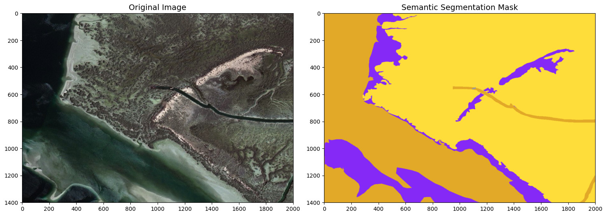
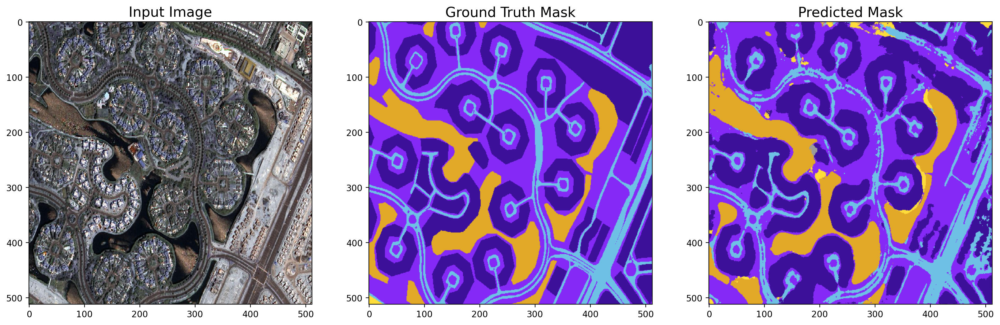

# Satellite Imagery Semantic Segmentation Using Deep Learning

## Abstract

Semantic segmentation is the task of clustering parts of an image together which belong to the same object class. It is a form of pixel-level prediction because each pixel in an image is classified according to a category. In this project, I have performed semantic segmentation on <a href="https://humansintheloop.org/resources/datasets/semantic-segmentation-dataset/">Dubai's Satellite Imagery Dataset</a> by using transfer learning on a InceptionResNetV2 encoder based UNet CNN model. In order to artificially increase the amount of data and avoid overfitting, I preferred using data augmentation on the training set. The model has achieved ~81% dice coefficient and ~86% accuracy on the validation set.

### Semantic Annotation

The images are densely labeled and contain the following 6 classes:

| Name       | R   | G   | B   | 
| ---------- | --- | --- | --- |
| Building   | 60  | 16  | 152 | 
| Land       | 132 | 41  | 246 | 
| Road       | 110 | 193 | 228 | 
| Vegetation | 254 | 221 | 58  | 
| Water      | 226 | 169 | 41  | 
| Unlabeled  | 155 | 155 | 155 | 

### Sample Images & Masks

## UNet Architecture

### Hyper-Parameters

1. Batch Size = 16.0
2. Steps per Epoch = 32.0
3. Validation Steps = 4.0
4. Input Shape = (256, 256, 3)
5. Initial Learning Rate = 0.0001 (with Exponential Decay LearningRateScheduler callback)
6. Number of Epochs = 45 (with ModelCheckpoint & EarlyStopping callback)

## Results

### Training Results

|         Model          |               Epochs               | Train Dice Coefficient | Train Accuracy | Train Loss | Val Dice Coefficient | Val Accuracy | Val Loss |
| :--------------------: | :--------------------------------: | :--------------------: | :------------: | :--------: | :------------------: | :----------: | :------: |
| InceptionResNetV2-UNet | 45 (best at 34th epoch) |         0.8525         |     0.9152     |   0.2561   |        0.8112        |    0.8573    |  0.4268  |

The <a href="./model_training.csv">`model_training.csv`</a> file contain epoch wise training details of the model.

### Visual Results

Predictions on Validation Set Images:

